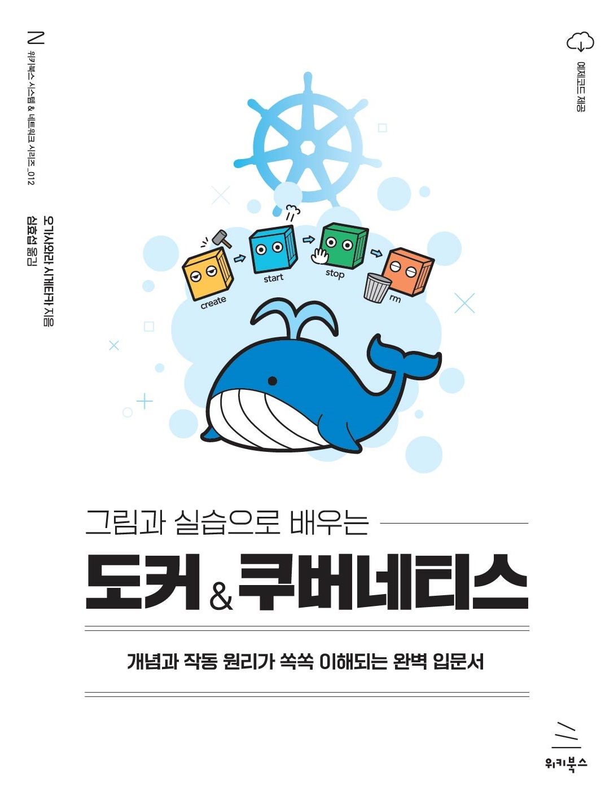

# 《그림과 실습으로 배우는 도커 & 쿠버네티스》

## 예제 파일

이 책의 예제 파일은 `sample_files` 폴더에 들어 있습니다.

## 참고 자료

#### 3장 2절 63쪽, 단계 4에서 리눅스 커널 업데이트에서 에러가 발생하는 경우

"wsl_update_x64.msi"를 관리자 권한으로 실행해 보세요.

#### 3장 2절 65쪽, Docker Desktop을 시작할 때 오류가 발생하는 경우

Docker Desktop을 관리자 권한으로 실행해 보세요.

#### 5장 4절에서 Redmine이 시작하지 않는 오류가 발생하는 경우

MySQL 컨테이너를 시작한 후 즉시 Redmine 컨테이너를 시작하면 MySQL 컨테이너가 아직 시작되지 않아 Redmine 컨테이너를 시작하지 못할 수 있습니다. 이는 Redmine 컨테이너가 시작될 때 MySQL에 연결할 수 없으면 종료되기 때문입니다. 해결책은 두 가지가 있습니다.

##### 해결 방법 1】 MySQL 컨테이너가 기동할 때까지 기다리고 나서 Redmine 컨테이너를 기동

MySQL 컨테이너를 기동한 뒤, docker ps 커맨드로 MySQL이 기동한 것을 확인한 후 Redmine 컨테이너를 시작합니다.

##### [해결 방법 2] Redmine 컨테이너 다시 시작

다음 명령을 입력해서 Redmine 컨테이너를 다시 시작합니다.

~~~
docker start redmine000ex14
~~~

또한 프로그램이 종료된 원인 등은 다음 커맨드를 통해 로그에서 확인할 수 있습니다.

~~~
docker logs redmine000ex14
~~~

#### 부록 03 342쪽, 도커 설치에 대해

최신 도커 설치 방법이 바뀌고 있습니다. 342쪽의 단계 1 또는 344쪽의 단계 6에 대해서는 다음 페이지를 참조합니다.

- https://docs.docker.com/engine/install/ubuntu/#install-using-the-repository

실행하는 범위는 "Install using the repository"에서 "Install Docker Engine"까지입니다.